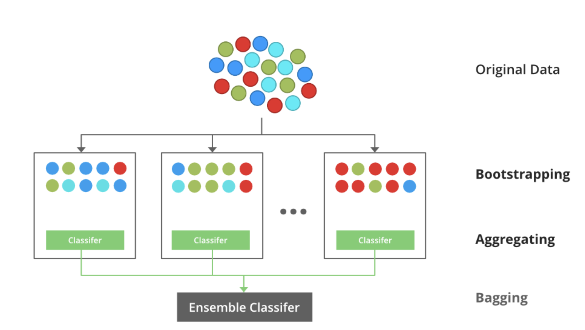
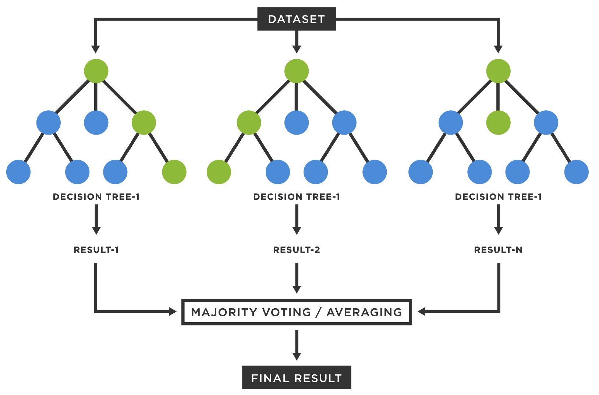

# Bagging

Bootstrap Aggregating, also known as bagging. 

Decision trees like CART select split points using a greedy algorithm that seeks to minimize a cost function, like the Gini index for classification. However, creating random sample of training data and choosing different split points will result different trees and different predictions. Combining these predictions from different models that have very different perspectives on the problem and this is where the power for bagging comes from [1].

Bootstrapping will randomly select repeated data points from the training set and create multiple subsets — sampling with replacement [2].

The next step is aggregating the output of each bootstrap. If it's a classification problem, then the final class is calculated based on the majority voting mechanism (`mode()`). If it's a regression problem then the target value is calculated from the average of all predictions.

## Random Forest

In random forest , the same principle of bagging is used, but with an additional randomization step. In addition to randomly sampling the training data, random forest also randomly selects a subset of the features at each split of the decision tree. This feature sampling helps to further decorrelate the trees and increase the diversity of the ensemble.

## References

[1] [Master Machine Learning Algorithms](https://machinelearningmastery.com/master-machine-learning-algorithms/)

[2] [Bagging Decision Trees — Clearly Explained](https://towardsdatascience.com/bagging-decision-trees-clearly-explained-57d4d19ed2d3)
