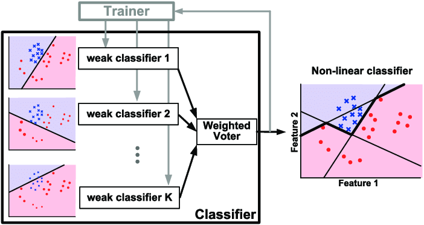

# Boosting

Boosting is a general ensemble method that creates a strong classifier from a number of weak classifiers. This is done by building a model from the training data, then creating a second model that attempts to correct the errors from the first model. Models are added until the training set is predicted perfectly or a maximum number of models are added [1].

Several variants of the algorithm are commonly used: *Adaboost*, *gradient boosting*, and *stochastic gradient boosting* [2]. AdaBoost (Adaptive Boosting) was the first really successful boosting algorithm developed for binary classification. The most suited and therefore most common algorithm used with AdaBoost are decision trees with one level [1].

  

  Illustration of AdaBoost algorithm [3]

Overall, AdaBoost is a powerful and flexible algorithm that can be applied to a wide range of problems, and has been shown to be highly effective in practice.

## References

[1] [Master Machine Learning Algorithms](https://machinelearningmastery.com/master-machine-learning-algorithms/)

[2] [Practical Statistics for Data Scientists](https://www.oreilly.com/library/view/practical-statistics-for/9781491952955/)

[3] [Realizing Low-Energy Classification Systems by Implementing Matrix Multiplication Directly Within an ADC](https://www.researchgate.net/publication/288699540_Realizing_Low-Energy_Classification_Systems_by_Implementing_Matrix_Multiplication_Directly_Within_an_ADC)
