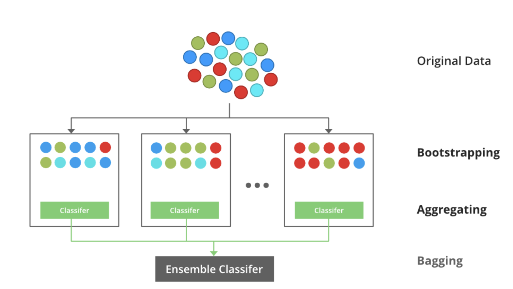
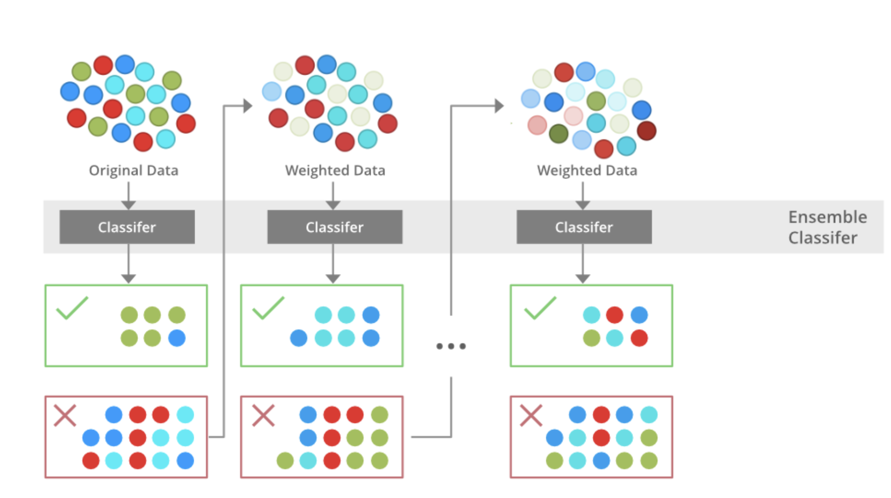

# Ensemble Algorithms

An ensemble comprises of a set of independently trained classifiers whose predictions are joined while characterizing novel instances. Past research has demonstrated that an ensemble is often more accurate than any of the single classifiers in the ensemble. Bagging, Boosting and Stacking are moderately yet prevalent strategies for delivering ensembles [1]. In summary, ensemble methods aim at improving predictability in models by combining several models to make one very reliable model. There are three types of ensemble algorithms:
1. Bagging
2. Boosting
3. Stacking

## 1. Bagging

Bootstrap Aggregating, also known as bagging. Bootstrap method

$$\bar{x} = \frac{1}{100} \times \sum_{i=1}^{100}x_i $$

## 2. Boosting

## References
[1] [Comparative Analysis of Linear, Non Linear and Ensemble Machine Learning Algorithms for Credit Worthiness of Consumers](https://www.researchgate.net/publication/335716566_Comparative_Analysis_of_Linear_Non_Linear_and_Ensemble_Machine_Learning_Algorithms_for_Credit_Worthiness_of_Consumers)
