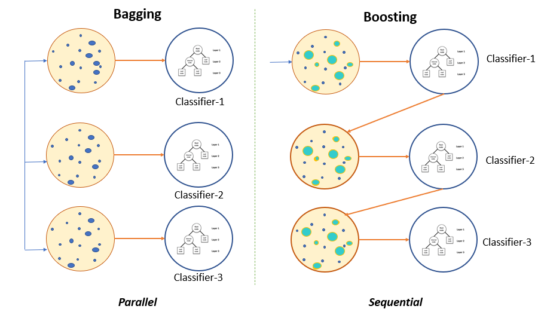

# Ensemble Algorithms

During a county fair in England in 1906, the statistician Sir Francis Galton observed a contest where participants were asked to guess the weight of an ox on display. Although the individual guesses varied widely, the average and median of all the guesses were found to be within 1% of the actual weight of the ox. James Surowiecki has studied this phenomenon in his book "The Wisdom of Crowds" and found that this principle can also be applied to predictive models. Using an ensemble of models, which involves averaging or majority voting, can result in more accurate predictions compared to using just one model [1].

An ensemble comprises of a set of independently trained classifiers whose predictions are joined while characterizing novel instances. Past research has demonstrated that an ensemble is often more accurate than any of the single classifiers in the ensemble. Bagging, Boosting and Stacking are moderately yet prevalent strategies for delivering ensembles [2]. In summary, ensemble methods aim at improving predictability in models by combining several models to make one very reliable model. There are three types of ensemble algorithms:

1. Bagging
2. Boosting
3. Stacking

In our study we'll cover the first two types of ensemble algorithms.

## References

[1] [Practical Statistics for Data Scientists](https://www.oreilly.com/library/view/practical-statistics-for/9781491952955/)

[2] [Comparative Analysis of Linear, Non Linear and Ensemble Machine Learning Algorithms for Credit Worthiness of Consumers](https://www.researchgate.net/publication/335716566_Comparative_Analysis_of_Linear_Non_Linear_and_Ensemble_Machine_Learning_Algorithms_for_Credit_Worthiness_of_Consumers)

[3] [Ensemble Methods in Machine Learning: Bagging Versus Boosting](https://www.pluralsight.com/guides/ensemble-methods:-bagging-versus-boosting)
