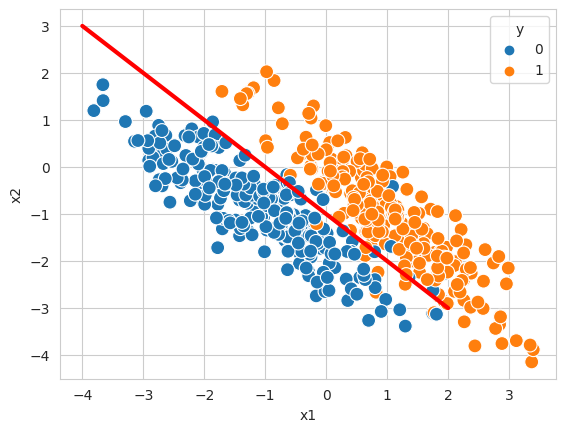

# Linear Algorithms

Linear algorithms assume, that the sample features $x$ and the label output $y$ are linearly related and there is an affine function $f(x)=wx + b$ describing the underlying relationship [1]. The known algorithms are:

- Linear Regression
- Logistic Regression
- Linear Discriminant Analysis

---
[1][Machine Learning Basics](https://blogs.fu-berlin.de/reseda/machine-learning-basics/#:~:text=This%20differentiation%20is%20straightforward%3A,relationship%20between%20x%20and%20y.)
