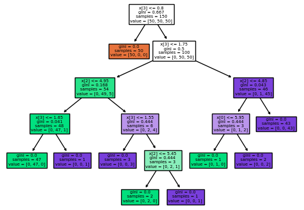

# Classification and Regression Trees

Tree models, also called Classification and Regression Trees (CART),decision trees, or just trees, are an effective and popular classification (and regression) method initially developed by Leo Breiman and others in 1984[1]. Decision tree learning is a non-parametric supervised learning approach used in statistics, data mining and machine learning. The goal is to create a model that predicts the value of a target variable by learning simple decision rules inferred from the data features[2]. In this formalism, a classification or regression decision tree is used as a predictive model to draw conclusions about a set of observations.

Tree models where the target variable can take a discrete set of values are called classification trees; in these tree structures, leaves represent class labels and branches represent conjunctions of features that lead to those class labels. Decision trees where the target variable can take continuous values (typically real numbers) are called regression trees[3].

Decision trees are effective because they are easy to read, powerful even with messy data, and computationally cheap to deploy once after training but expensive to train. They carry a big risk of overfitting, and tend to find local optima because they can’t go back after they have made a split [4].

---
## References
[1] [Practical Statistics for Data Scientists](https://www.oreilly.com/library/view/practical-statistics-for/9781491952955/)

[2] [Decision Trees](https://scikit-learn.org/stable/modules/tree.html)

[3] [Decision Tree Learning](https://en.wikipedia.org/wiki/Decision_tree_learning)

[4] [Machine Learning for Humans](https://everythingcomputerscience.com/books/Machine%20Learning%20for%20Humans.pdf)

