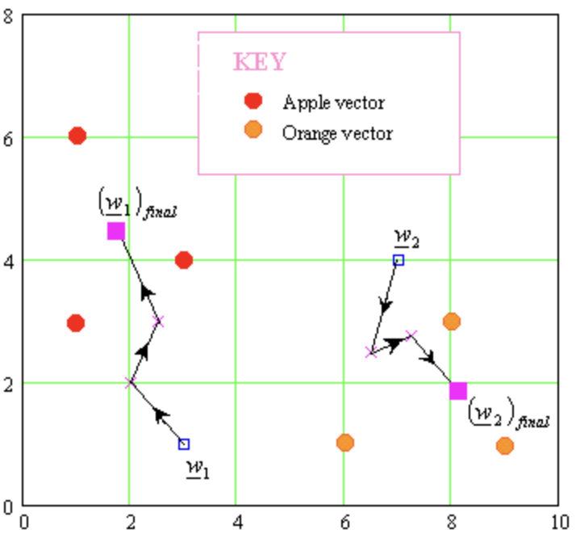

# Learning Vector Quantization (LVQ)

In computer science, learning vector quantization (LVQ) is a prototype-based supervised classification algorithm[1]. LVQ is a family of algorithms for statistical pattern classification, which aims at learning prototypes (codebook vectors) representing class regions. The class regions are defined by hyperplanes between prototypes, yielding Voronoi partitions[2].

A codebook vector is a list of numbers that have the same input and output attributes as your training data. The model representation is a fixed pool of codebook vectors, learned from the training data. They look like training instances, but the values of each attribute have been adapted based on the learning procedure. In the language of neural networks, each codebook vector may be called a neuron, each attribute on a codebook vector is called a weight and the collection of codebook vectors is called a network [3].

---
## References

[1] [Learning Vector Quantization](https://en.wikipedia.org/wiki/Learning_vector_quantization)

[2] [A Review of Learning Vector Quantization Classifiers](https://arxiv.org/pdf/1509.07093.pdf)

[3] [Master Machine Learning Algorithms](https://machinelearningmastery.com/master-machine-learning-algorithms/)
