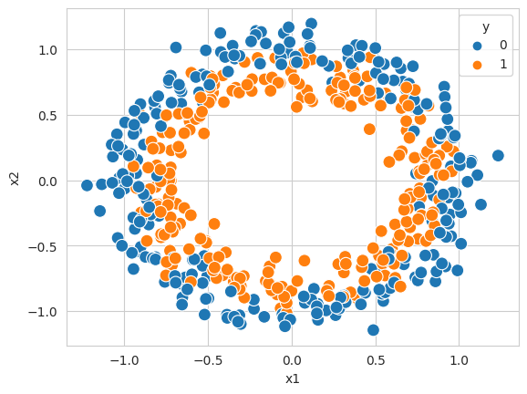

# Nonlinear Algorithms

Nonlinear algorithms assumes a nonlinear relationship between features and label. Thus, $f(x)$ can by a function of arbitrary complexity [1]. The known algorithms are:

* Classification and Regression Trees (CART)
* Naive Bayes
* Gaussian Naive Bayes
* k-Nearest Neighbors
* Learning Vector Quantization (LVQ)
* Support Vector Machines

---
[1][Machine Learning Basics](https://blogs.fu-berlin.de/reseda/machine-learning-basics/#:~:text=This%20differentiation%20is%20straightforward%3A,relationship%20between%20x%20and%20y.)
