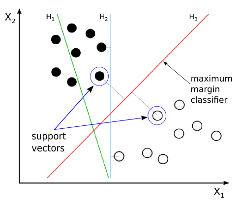

# Support Vector Machines (SVM)

In machine learning, support vector machines (SVMs, also support vector networks) are supervised learning models with associated learning algorithms that analyze data for classification and regression analysis [1].

## References
---
[1] [Support vector machine](https://en.wikipedia.org/wiki/Support_vector_machine)
