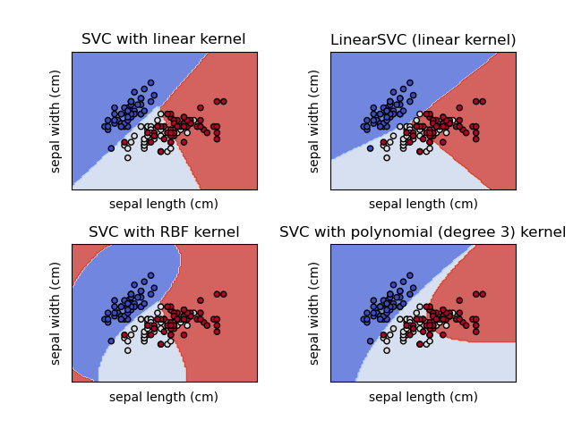

# Support Vector Machines (SVM)

<figure>
  
  <figcaption align = "right"><b>Fig.1 - 4K Mountains Wallpaper</b></figcaption>
</figure>

In machine learning, support vector machines (SVMs, also support vector networks) are supervised learning models with associated learning algorithms that analyze data for classification and regression analysis [1]. Before going deep in SVM, there are 2 things that must be learned.

## 1. Maximal-Margin Classifier

Maximal-Margin Classifier is a hypothetical classifier and it explain how SVM works. The features (inputs) in your data may form a n-dimensional space. 

A hyperplane is a line that splits the input variable space by their classes. If the we have 2 inputs which mean that we have 2 dimentional space and the hyperplane can be visualized as a line as shown in the above image. This line can be defined as below formula:

$$B_0 + (B_1 × X_1) + (B_2 × X_2) = 0$$

Where $X_1$ and $X_2$ are the two input variables, $B_1$ and $B_2$ are the coefficients that determine the slope of the line and $B_0$ the intercept. The coefficients and the intercept are found by the learning algorithm. The distance between the line and the closest data points are called as the margin. The best or optimal line that can separate the classes is the line that has the largest margin. This is called the Maximal-Margin hyperplane. The margin is calculated as the perpendicular distance from the line to only the closest points. These points are called the **support vectors**. The hyperplane is learned from training data using an **optimization procedure that maximizes the margin**.

## 2. Soft Margin Classifier

## 3. Kernels

### 3.1. Linear Kernel SVM

$$K(x, x_i) = \sum(x \times x_i)$$

### 3.2. Polynomial Kernel SVM

$$K(x, x_i) = 1 + \sum(x \times x_i)^d$$

### 3.3. Radial Kernel SVM
$$K(x, x_i) = e^{-\gamma \times \sum(x - x_i)^2}$$

  

## References
---
[1] [Support vector machine](https://en.wikipedia.org/wiki/Support_vector_machine)

Image is from [Support Vector Machine (SVM)](https://nl.mathworks.com/discovery/support-vector-machine.html) artical of MathWorks.
Kernels image is from [Support Vector Machines](https://scikit-learn.org/stable/modules/svm.html)
